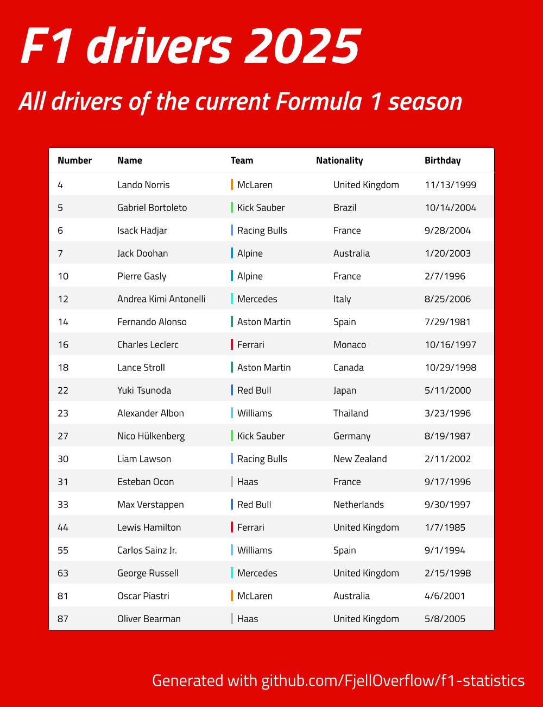

<h1 align="center">F1 Statistics</h1>

<p align="center">
  Generate good-looking infographics from Formula 1 statistics.
</p>

<p align="center">
  
</p>

<p align="center">
  <a href="#features">Features</a> |
  <a href="#installation">Installation</a> |
  <a href="#getting-started">Getting started</a> |
  <a href="#development">Development</a>
</p>

## Features

- 🏁 Query Formula 1 data with SQL
- ⚙️ Process data with Typescript
- 📊 Generate infographics
- 🌎 Country icons support
- 🎨 Team colors support
- 👨‍💻  **For developers**: Strongly typed & linted

## Installation

1. Download the latest F1DB from the [releases page](https://github.com/f1db/f1db/releases). Choose the `f1db-sqlite.zip` asset and extract the `f1db.db` file from the zipped folder into the root directory.

2. Make sure you have [Bun](https://bun.sh) installed on your system.

3. Install the generator dependencies.

```bash
cd generator
bun install
```

## Getting started

1. To generate an infographic, create your generation script, which would roughly look like this:

```ts
import { Database } from 'bun:sqlite'
import generate from './generator'
import { TableTemplate } from './generator/templates'

// connect to DB
const db = new Database('f1db.db')

// query data
const table = db.query("SELECT * FROM driver WHERE country_id = 'germany'").all()

// configure template
const template = TableTemplate({ table })

// generate image
generate(template)

// close FB connection
db.close()
```

2. When done, run the script.

```bash
bun run generate.ts
```

For a more interactive example, a `generate.ts` script can be found in the root directory. It shows how an overview of the current seasons F1 drivers can queried, processed and rendered to a nice table. It features plenty of helpful comments and hightlights the different configuration options.

## Development

The project consists of two moving parts: the `sql` and `generator` subdirectories. They need to be set up separately.

In VS Code the project can be opened as separate workspaces by opening the file `.vscode/f1-statistics.code-workspace` and clicking on *Open Workspace*.

The `generator` should already be setup from the initial project [Installation](#installation).

### Setup `sql`

1. Make sure you have [pip](https://pip.pypa.io/en/stable/installation/) installed on you system.

2. Install [SQLFluff](https://docs.sqlfluff.com/en/stable/index.html).

```bash
pip install sqlfluff
```

### Linting & Formatting

VS Code is configured to lint and format files on save; `.sql` files with [SQLFluff](https://docs.sqlfluff.com/en/stable/index.html) and (`.ts(x)` / `.json`) files with [Biome](https://biomejs.dev/).

To lint files manually, open the respective subfolder (`sql` or `generator`) and run the respective commands.

- `sqlfluff lint my-file.sql` and `sqlfluff fix my-file.sql` to lint and format SQL files
- `bun check` and `bun lint` to typecheck and format TypeScript files
